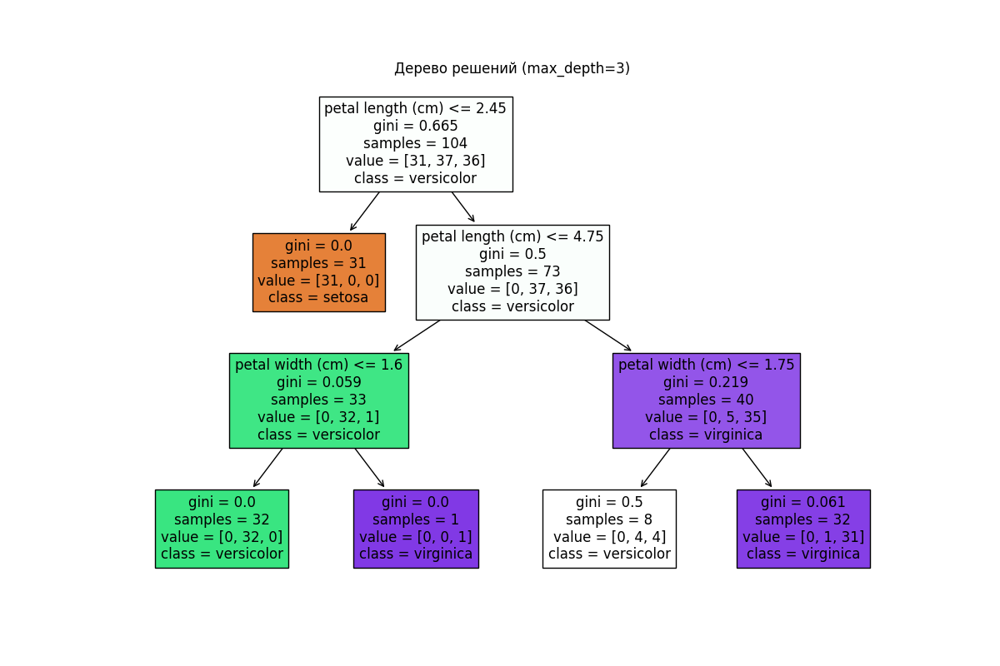

# Отчет по дереву решений
## Дерево решений для глубины 1

## Дерево решений для глубины 3

## Дерево решений для глубины 5

## Дерево решений для глубины 7

## Дерево решений для глубины 10

## Результаты

### Таблица с глубиной, точностью и количеством правильно классифицированных:
|   Глубина |   Точность |   Количество правильно классифицированных |
|----------:|-----------:|------------------------------------------:|
|         1 |   0.711111 |                                        32 |
|         3 |   1        |                                        45 |
|         5 |   1        |                                        45 |
|         7 |   1        |                                        45 |
|        10 |   1        |                                        45 |
### Лучшая глубина: 3
### Устойчивость для лучшей глубины:
|   Iteration |   Train Size |   Test Size |   Correct |   Incorrect |
|------------:|-------------:|------------:|----------:|------------:|
|           1 |           93 |          45 |        44 |           1 |
|           2 |           93 |          45 |        44 |           1 |
|           3 |           93 |          45 |        44 |           1 |
