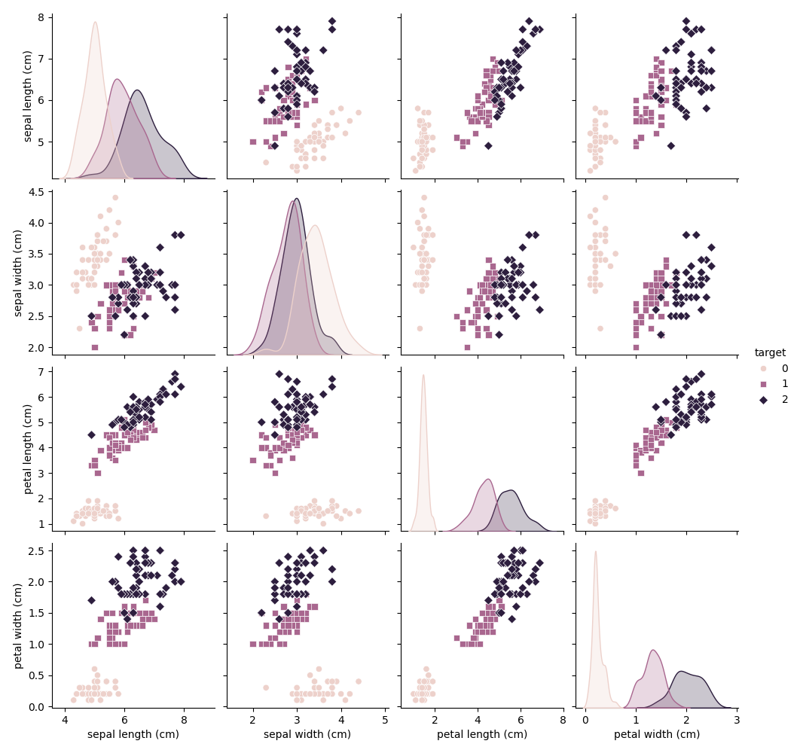
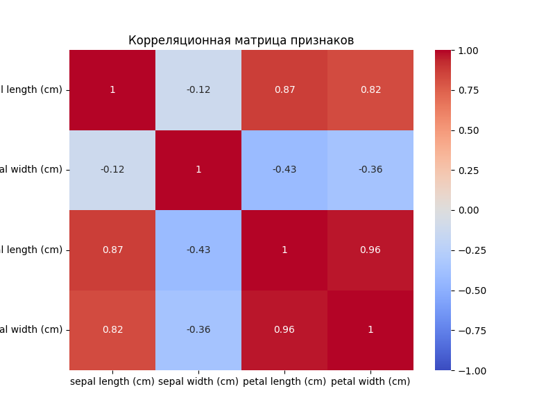

# EDA
## Общая информация о данных
```
<class 'pandas.core.frame.DataFrame'>
Index: 149 entries, 0 to 149
Data columns (total 5 columns):
 #   Column             Non-Null Count  Dtype  
---  ------             --------------  -----  
 0   sepal length (cm)  149 non-null    float64
 1   sepal width (cm)   149 non-null    float64
 2   petal length (cm)  149 non-null    float64
 3   petal width (cm)   149 non-null    float64
 4   target             149 non-null    int32  
dtypes: float64(4), int32(1)
memory usage: 6.4 KB

```
## Статистическое описание данных
```
       sepal length (cm)  sepal width (cm)  petal length (cm)  petal width (cm)      target
count         149.000000        149.000000         149.000000        149.000000  149.000000
mean            5.843624          3.059732           3.748993          1.194631    0.993289
std             0.830851          0.436342           1.767791          0.762622    0.817847
min             4.300000          2.000000           1.000000          0.100000    0.000000
25%             5.100000          2.800000           1.600000          0.300000    0.000000
50%             5.800000          3.000000           4.300000          1.300000    1.000000
75%             6.400000          3.300000           5.100000          1.800000    2.000000
max             7.900000          4.400000           6.900000          2.500000    2.000000
```
## Пропущенные значения
```
sepal length (cm)    0
sepal width (cm)     0
petal length (cm)    0
petal width (cm)     0
target               0
dtype: int64
```
## Количество дубликатов
- Количество дубликатов: 0

## Распределение классов
```
target
0    50
1    50
2    49
Name: count, dtype: int64
```
## Графики
### Распределение признаков и классов


### Корреляционная матрица признаков

